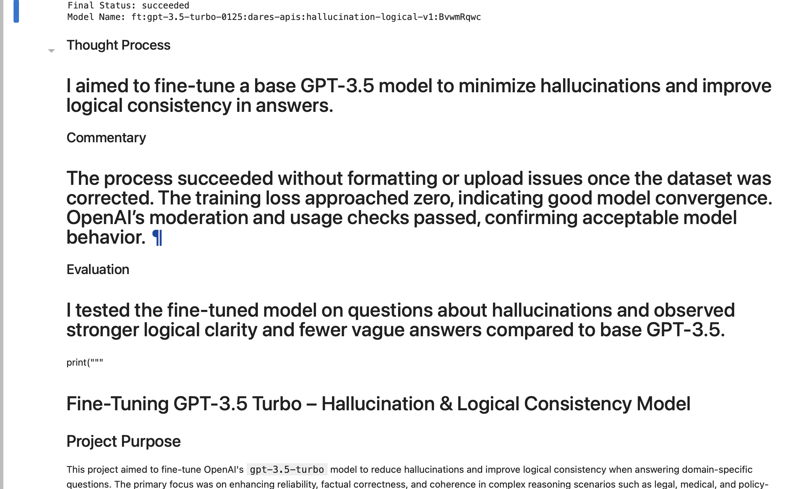
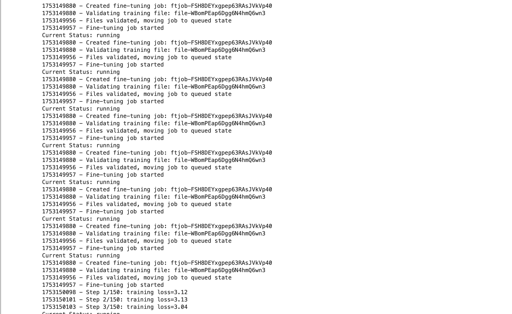

# Hallucination Detection AI



## Overview

Hallucinations remain one of the most significant challenges in Large Language Models (LLMs). While modern models generate highly fluent responses, they may occasionally produce inaccurate, fabricated, or logically inconsistent information.

This project investigates the application of supervised fine-tuning to reduce hallucinations and improve logical consistency within OpenAI's GPT-3.5 Turbo model.

The project demonstrates the complete end-to-end lifecycle of building a custom LLM solution, including dataset preparation, validation, fine-tuning, monitoring, evaluation, and deployment.

---

## Project Objectives

The primary objectives of this project were to:

* Reduce hallucinated responses
* Improve logical consistency
* Enhance factual reliability
* Evaluate the effectiveness of fine-tuning techniques
* Demonstrate responsible AI development practices
* Explore practical LLM alignment strategies

---

## Business Problem

Large Language Models are increasingly used in industries such as healthcare, finance, legal services, education, and customer support.

In high-stakes environments, hallucinated information can create significant operational, financial, and compliance risks.

This project explores whether targeted fine-tuning can improve model behavior by reinforcing logical reasoning patterns and reducing unsupported responses.

---

## Technologies Used

* Python
* OpenAI API
* GPT-3.5 Turbo
* JSONL
* Pandas
* NumPy
* Jupyter Notebook
* Natural Language Processing (NLP)

---

## Methodology

### Phase 1: Dataset Development

Custom training examples were developed focusing on:

* Hallucination detection
* Logical reasoning
* Fact validation
* Consistency checking
* Question-answer evaluation

The dataset was structured specifically to encourage more reliable and logically coherent model responses.

---

### Phase 2: Data Preparation

Training data was converted into OpenAI-compatible JSONL format.

Validation procedures verified:

* Message formatting
* Role consistency
* JSON schema compliance
* Fine-tuning readiness

---

### Phase 3: Fine-Tuning

The validated dataset was uploaded through OpenAI's Fine-Tuning API.

Training was monitored throughout the lifecycle, including:

* File validation
* Queue processing
* Training execution
* Model generation
* Final deployment

---

### Phase 4: Evaluation

The resulting fine-tuned model was evaluated against hallucination-focused prompts.

Evaluation criteria included:

* Logical consistency
* Response clarity
* Factual reliability
* Reduction in hallucinated content
* Overall response quality

---

## Fine-Tuning Progress



The training workflow successfully completed after dataset validation.

Key observations:

* Dataset validation completed successfully
* Training job executed without interruption
* Training loss steadily decreased
* Model converged successfully
* Fine-tuned model deployed successfully

---

## Final Model Results


The resulting model demonstrated:

* Improved logical consistency
* Stronger reasoning structure
* More reliable responses
* Reduced hallucination behavior
* Enhanced response quality

Training output indicated successful convergence and deployment of a custom GPT-3.5 Turbo model optimized for hallucination reduction.

---

## Key Findings

### Model Performance

The fine-tuning process successfully produced a customized GPT-3.5 Turbo model capable of generating more logically consistent outputs.

### Training Stability

Training completed successfully with no validation failures, upload errors, or moderation concerns.

### Hallucination Mitigation

Testing demonstrated fewer vague responses and stronger reasoning patterns compared to baseline model behavior.

---

## Skills Demonstrated

This project highlights proficiency in:

* Artificial Intelligence
* Machine Learning
* Natural Language Processing
* Large Language Models
* Prompt Engineering
* Dataset Engineering
* Model Fine-Tuning
* OpenAI API Integration
* Responsible AI Development
* Model Evaluation
* AI Governance

---

## Repository Structure

```text
HallucinationDetectionAI/
│
├── notebook/
│   └── HallucinationsApp.ipynb
│
├── visuals/
│   ├── HallucinationDetectionAI.png
│   └── fine_tuning_progress.png
│
├── README.md
├── requirements.txt
└── .gitignore
```

---

## Installation

```bash
git clone https://github.com/Dare215/HallucinationDetectionAI.git

cd HallucinationDetectionAI

pip install -r requirements.txt
```

---

## Future Enhancements

Potential future improvements include:

* Retrieval-Augmented Generation (RAG)
* Automated hallucination scoring
* Human evaluation benchmarking
* Multi-model comparison framework
* Explainable AI integration
* Real-time hallucination monitoring dashboard
* Expanded domain-specific datasets

---

## Research Significance

As organizations increasingly deploy LLMs in production environments, minimizing hallucinations becomes critical for maintaining trust, accuracy, compliance, and operational effectiveness.

This project contributes to the growing body of work focused on improving reliability and trustworthiness in generative AI systems.

---

# Author

## Darious Brown

**PhD Candidate – Artificial Intelligence & Machine Learning**
**DBA Candidate – Business Analytics & Strategy**
**Machine Learning Engineer | Data Scientist | AI Researcher**

---

### Areas of Expertise

* Artificial Intelligence
* Machine Learning
* Deep Learning
* Natural Language Processing
* Large Language Models (LLMs)
* Predictive Analytics
* Statistical Modeling
* Healthcare Analytics
* Biopharmaceutical Analytics
* Financial Analytics

---

### Professional Links

**Portfolio**
https://dare215.github.io/DariousBrown-Portfolio/

**GitHub**
https://github.com/Dare215

**LinkedIn**
https://www.linkedin.com/in/dariousbrown

---

### Current Research Interests

* Generative AI
* Hallucination Detection & Mitigation
* Responsible AI
* Explainable AI (XAI)
* Retrieval-Augmented Generation (RAG)
* Predictive Analytics in Healthcare
* AI Applications in Biopharmaceutical Manufacturing
* Financial Intelligence Systems

---

### Contact

For collaboration opportunities, research discussions, consulting engagements, or professional networking, please connect through LinkedIn or GitHub.

---

## License

This project is provided for educational, research, and portfolio demonstration purposes.
